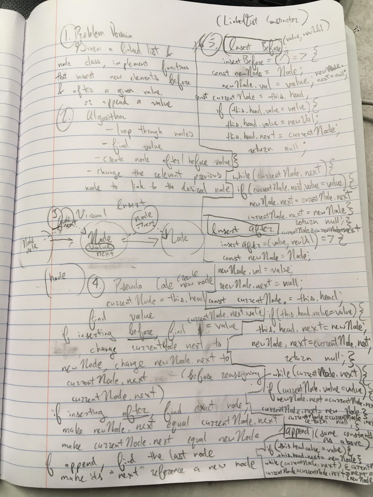

This challenge is about writing some methods for a linked list of nodes.
There is a append method, and an insert before and after a given value method respectively.

(maybe not the greatest looking whiteboard ever)

