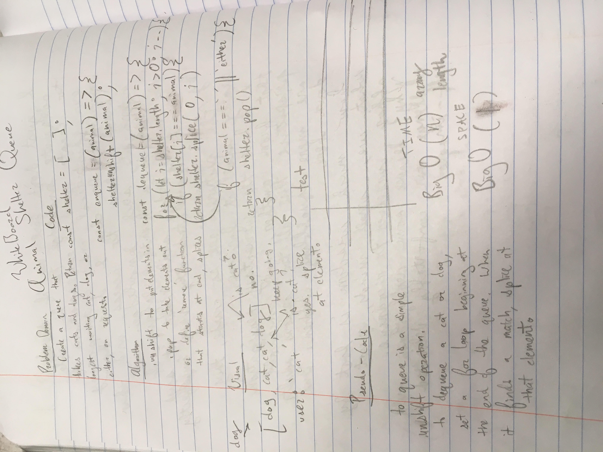

An animal shelter runs according to a first in, first out format. 
The challenge is to create a function to enqueue animals into the shelter (which is a queue), and another function to dequeue them from the shelter.
The shelter has cats and dogs in it, and on the dequeue function the user can specify which type of animal they would like to dequeue. 
If no animal is specified, the last animal in the queue (oldest animal) is dequeued.

image: 

