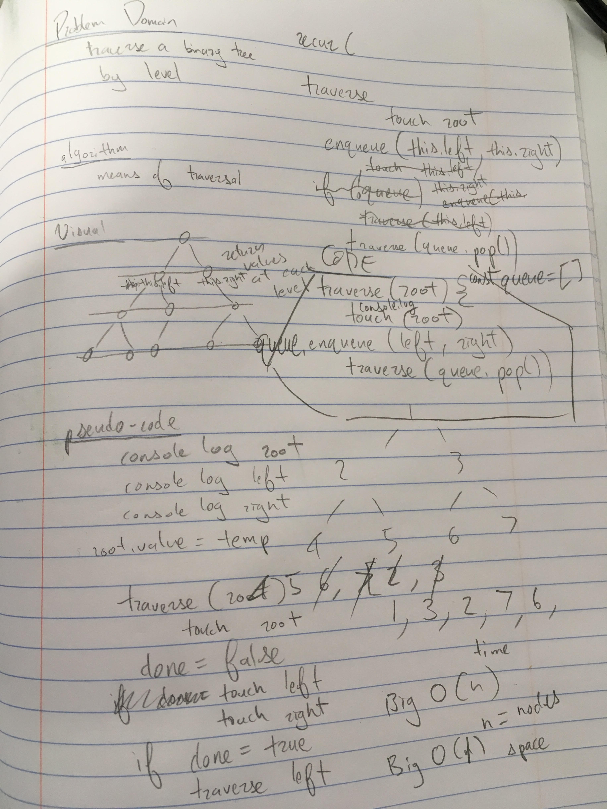

This challenge involves writing a function that will return the node values of a binary tree by level, that is, at each successive height from the original root, before the values at the next height, and the next, and so on. 

The challenge involves using a queue-type data structure in which nodes are touched depending on their place in the queue, and push their children into the queue when touched.

image:

