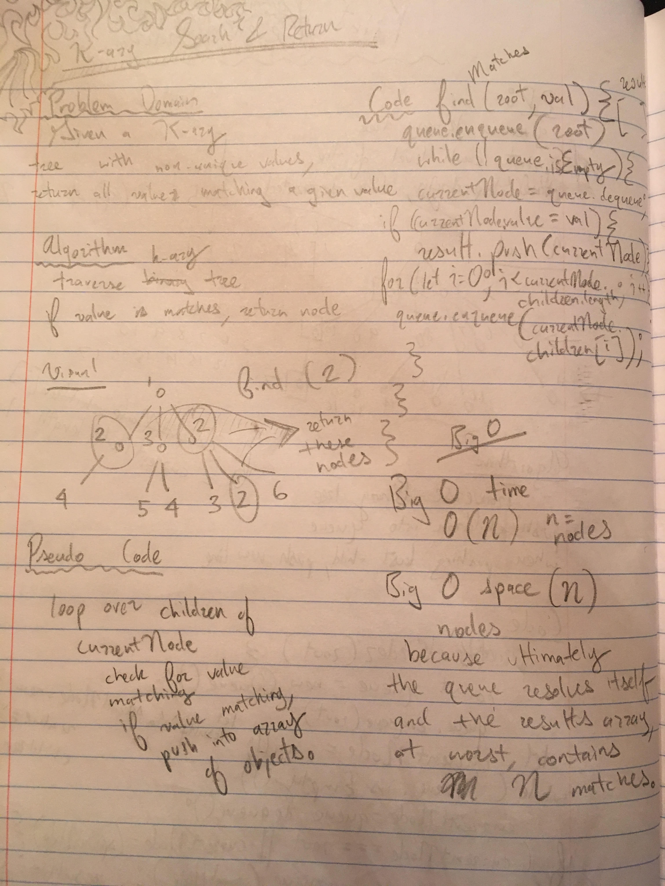

This application creates a kAry tree with a method called 'findMatches' that ultimately returns an array of objects (nodes) that have a value property matching the argument passed into the method.

image: 

