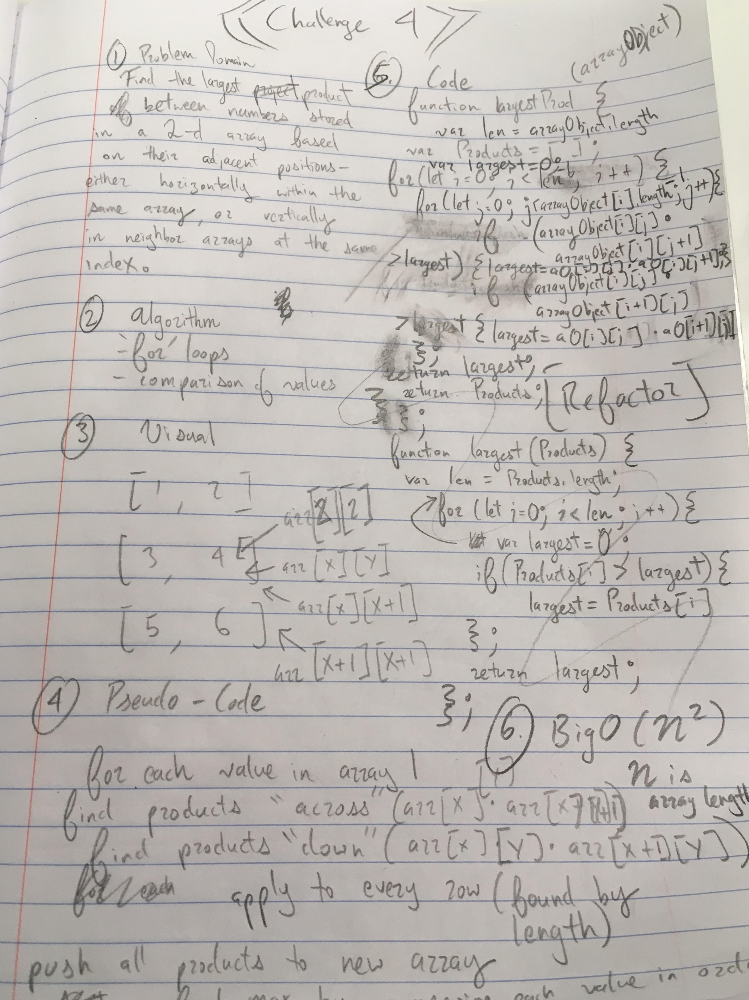

## Challenge
This challenge is about multiplying numbers from a "2-d array". Adjacent numbers are multiplied across, within a single array, and down, from one array to the next with the same index value (as if the arrays are stacked).

The function takes in an array of arrays.

## Solution
