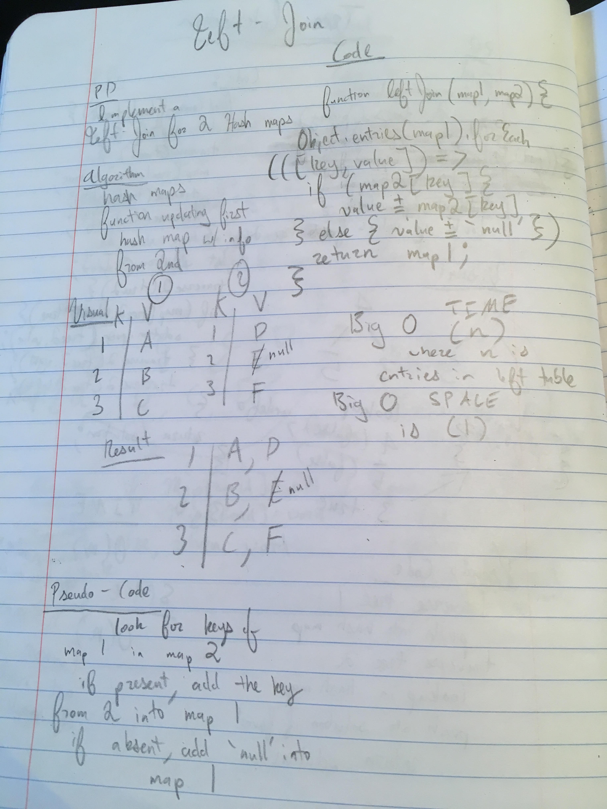

This application takes in two arguments, both hash maps. 
It appends the values of the second hash maps keys, if they match keys in the first, to the first hash map. If the first hash map contains keys that are absent in the second, a string 'null' is appended.

image: 

