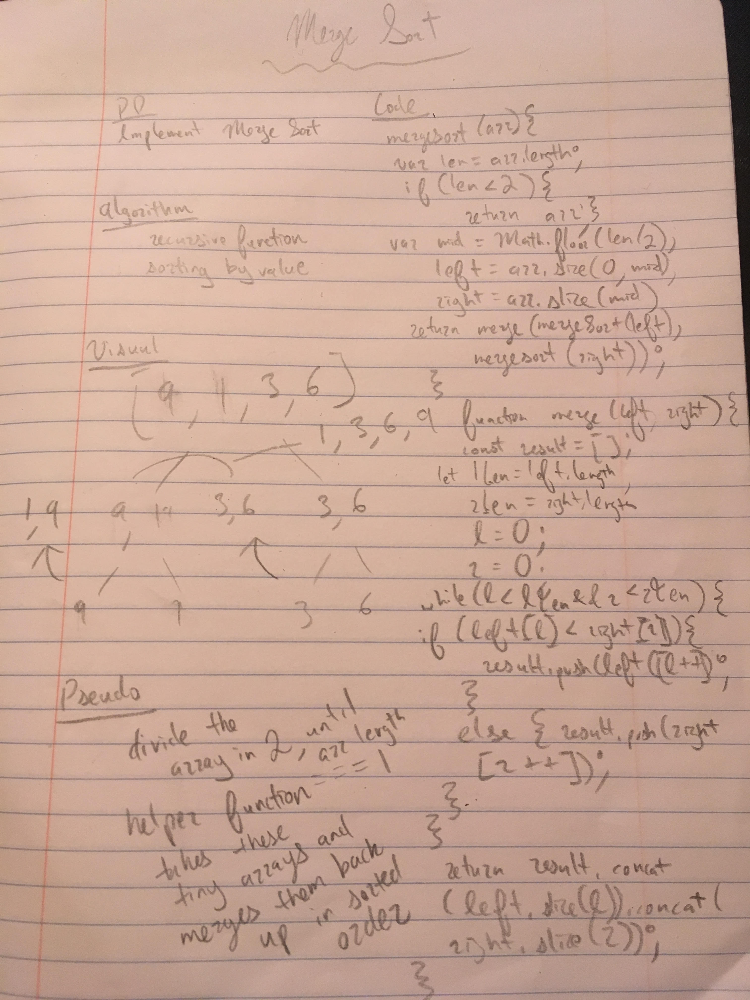

This is an implementation of a "mege sort"
It recursively splits an unsorted array by half until all the arrays are one item, and then rebuilds them in a sorted order.

implementation from :

https://hackernoon.com/programming-with-js-merge-sort-deb677b777c0

image: 

