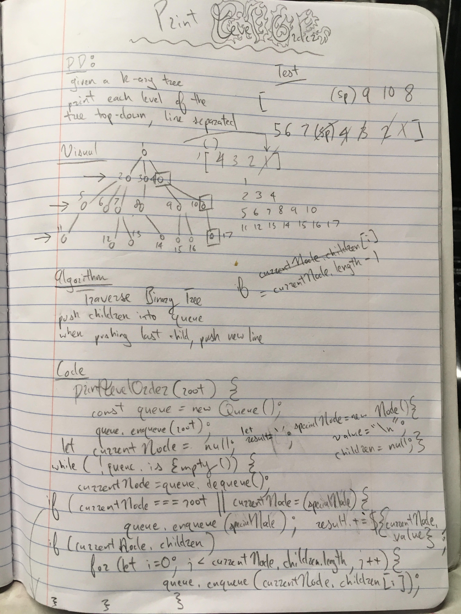

This application creates a kAry tree with a method called 'printLevelOrderTraversal' that ultimately returns a string formatted in rows, with the nodes on each level arranged one on top of another.

image: 

