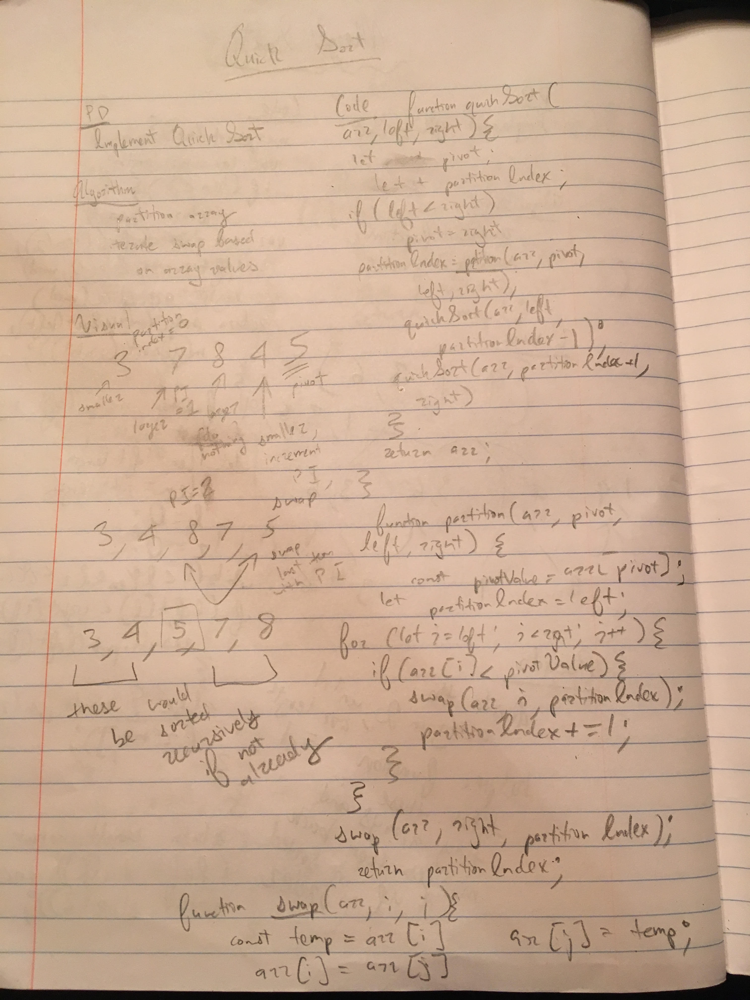

This is an implementation of a quick sort.
Quick sort works recursively. It first sorts all values in the unsorted array in relation to a single pivot, which in this implementation is the last value in the array. 
Then, it calls itself on the sub-arrays formed on either side of the partition index, which is where the pivot ends up.
This process continues until the left and right indices passed into the quickSort function are the same and no more sorting cans be done. 

Partition and swap are modded into helper functions.

implementation from :

http://khan4019.github.io/front-end-Interview-Questions/sort.html#quickSort

image: 

