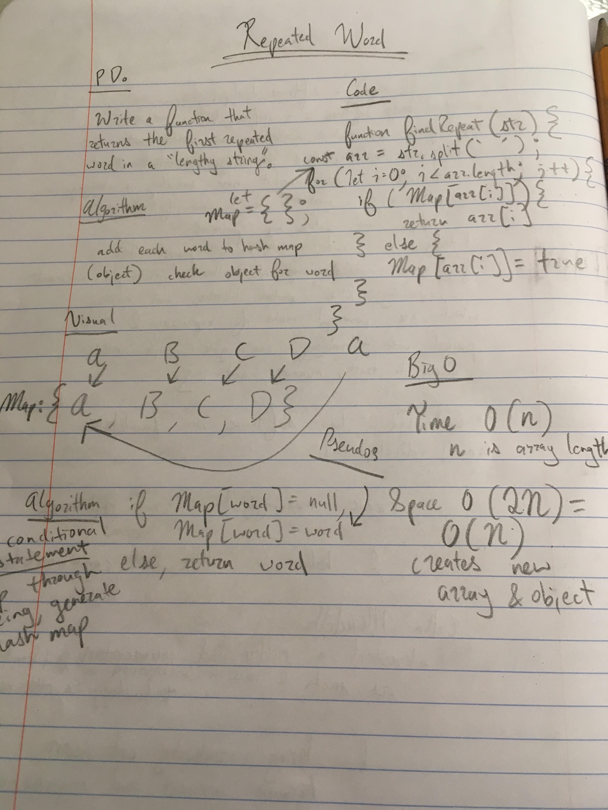

This application takes in a "lengthy string" and returns the first word in that string that appears more than one time. Thus, its name-- "repeated word". 

The application utilizes a hash-map style data-structure, which gives it an overall Big O time of O (n).

image: 

