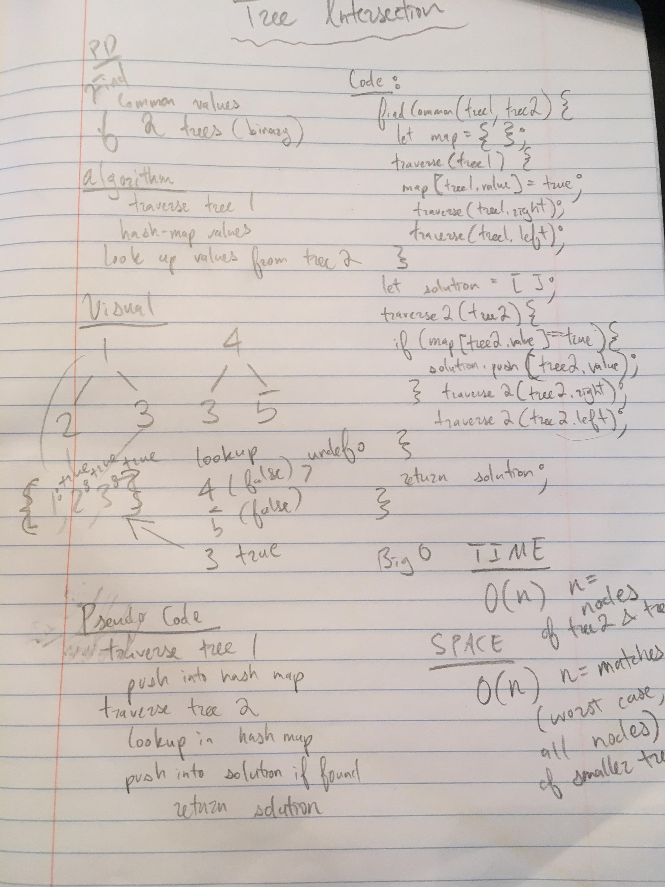

This challenge tasked students with writing a function that takes in two binary trees and returns all values that are common to both trees.

This is perhaps most easily accomplished using tree-traversal and a hash-map of values from the first tree traversed, referenced by the traversal of the second tree's values.

image:

