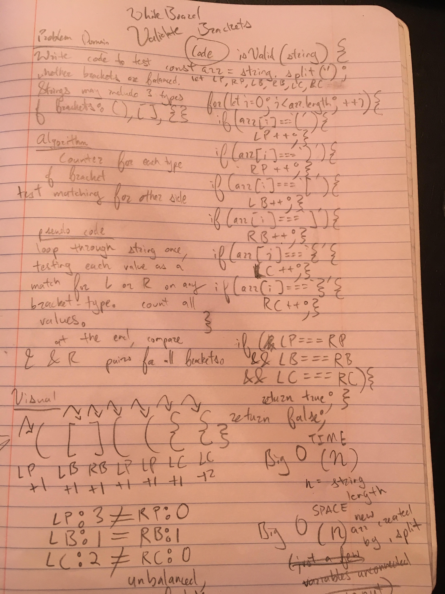

this challenge consists of writing a function that tests whether all brackets in a string are matched, that is, contain paired sets of opening and closing brackets.
This is done for three types of brackets: (), [], and {}.

image: 

